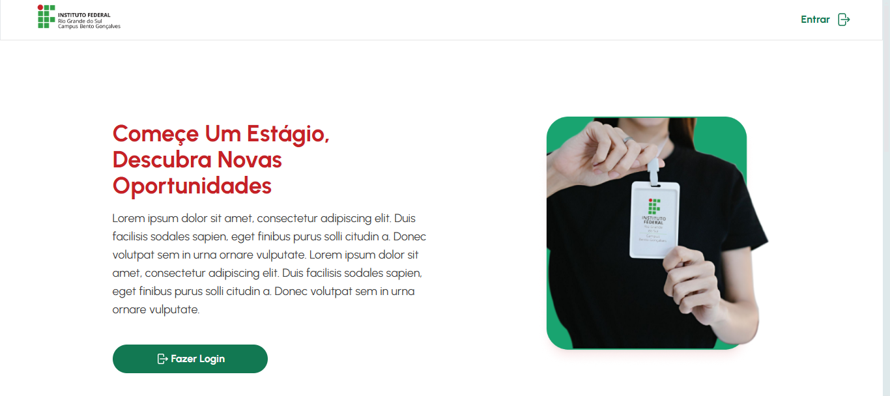
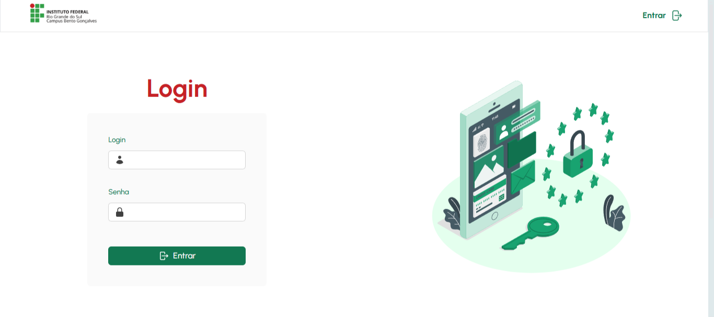
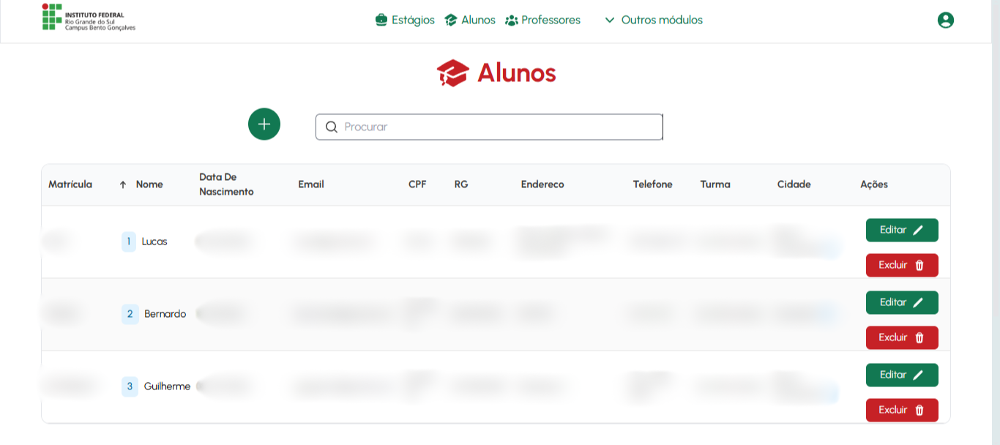
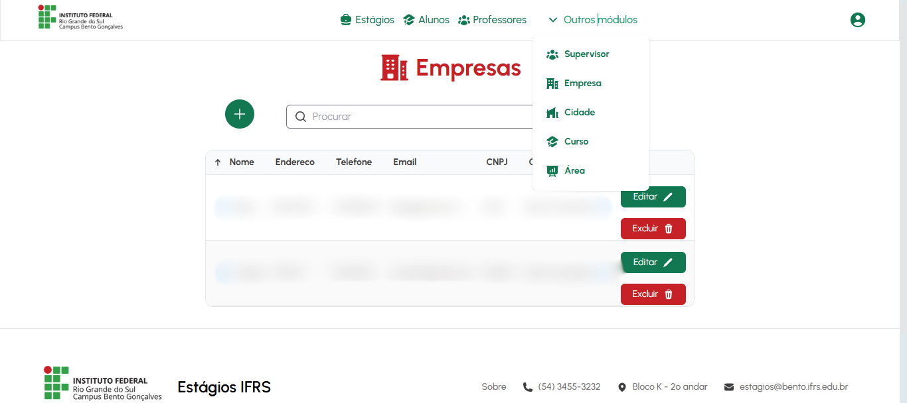

# 🏫 **Sistema de Gerenciamento de Estágios**

> **Nota**: Este projeto foi desenvolvido exclusivamente como parte de um trabalho interdisciplinar acadêmico no **IFRS - Campus Bento Gonçalves** e não chegou a ser implantado em um ambiente de produção. O sistema foi projetado para fins de aprendizado e desenvolvimento técnico dos envolvidos.

O **Sistema de Gerenciamento de Estágios** é uma aplicação desenvolvida como parte de um trabalho interdisciplinar nos cursos de **Programação Web II**, **Interface Web** e **Banco de Dados**.  
O projeto tem como objetivo principal auxiliar no gerenciamento dos estágios acadêmicos, facilitando o cadastro, acompanhamento e controle de informações relacionadas a alunos, empresas, supervisores e professores.

🤖 Desenvolvido por: **Eduardo Marcolin**, **Lucas Antunes** e **Guilherme Guerra**.

## 🛠️ **Funcionalidades**

- **Gerenciamento de Alunos**  
  - Cadastro, edição e exclusão de registros de alunos.  
  - Vinculação de alunos a estágios específicos.  
  - Exibição de listas com filtros personalizáveis.

- **Gestão de Empresas e Supervisores**  
  - Cadastro e consulta de empresas parceiras e supervisores.  
  - Relacionamento entre empresas e estágios vinculados.

- **Cadastro de Professores**  
  - Registro de professores responsáveis pelos estágios.  
  - Controle de dados dos supervisores acadêmicos.

- **Registro de Estágios**  
  - Inclusão de estágios detalhados com vinculação de empresas, alunos e supervisores.  
  - Consulta e edição de estágios cadastrados.

- **Relatórios Detalhados**  
  - Listagem de estágios por status, período ou área de atuação.  
  - Exportação de dados para análises externas (futuro).

- **Interface Responsiva**  
  - Design otimizado para dispositivos móveis e desktops, garantindo acessibilidade.

## 💻 **Tecnologias Utilizadas**

- **PHP**: Linguagem principal para o backend.  
- **MySQL**: Banco de dados relacional para armazenamento das informações.  
- **Tailwind CSS**: Framework CSS para design moderno e responsivo.  
- **Composer**: Gerenciador de dependências do PHP.  
- **XAMPP**: Ferramenta para execução local do Apache e MySQL.

## 🖼️ **Prévia**

| Página Inicial | Tela de Login |
|-------------------------------|-------------------------------|
|  |  |

| Gerenciamento de Alunos| Gerenciamento de Empresas |
|-------------------------------|-------------------------------|
|  |  |

## ⚙️ **Pré-requisitos**

- [XAMPP](https://www.apachefriends.org/index.html) instalado.  
- Composer instalado globalmente no sistema.  
- Navegador web atualizado.  

## 📝 **Instalação e Execução**

### 1. Clonar o Repositório

```bash
git clone https://github.com/eduardomarcolin09/SistemaEstagios2023.git
```

### 2. Configurar o Ambiente

- Extraia o projeto para a pasta htdocs do XAMPP.
Exemplo: C:\xampp\htdocs\SistemaEstagios2023
- Ajuste o arquivo config.php para configurar as credenciais do banco de dados:

```php
define('DB_HOST', 'localhost');
define('DB_USER', 'root');
define('DB_PASS', '');
define('DB_NAME', 'nome_do_banco');
```

### 3. Importar o Banco de Dados

- Acesse o phpMyAdmin pelo navegador: http://localhost/phpmyadmin.
- Crie um banco de dados com o nome especificado no arquivo config.php.
- Importe o arquivo estagios.sql da raiz do projeto.

### 4. Iniciar o Servidor

- Inicie o Apache e o MySQL no painel do XAMPP.
- Acesse o sistema no navegador: http://localhost/SistemaEstagios2023.

### 5. Acessar o Sistema

- Use o seguinte login já cadastrado no banco de dados:
  - Usuário: admin
  - Senha: admin

## 📂 Estrutura do Projeto

- index.php: Página inicial do sistema.
- config.php: Configurações de conexão com o banco de dados.

- controllers/: Lógica de controle do sistema.
- models/: Interações com o banco de dados.

- views/: Interfaces e páginas do sistema.

- uploads/: Pasta para armazenamento de arquivos enviados.

- Diagrama ER - Sistema Estágio.png: Representação visual do banco de dados.

## 📚 Notas Finais

Este sistema foi desenvolvido exclusivamente para fins acadêmicos e não está em produção.

Melhorias futuras podem incluir:

- Integração com APIs externas.
- Relatórios gráficos dinâmicos.
- Implementação de notificações automáticas para alunos e empresas.